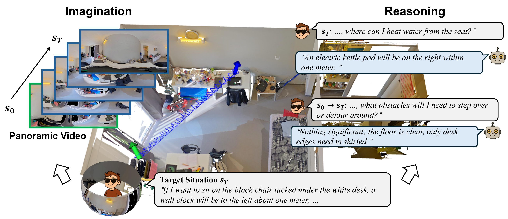

<div align="center">

# WanderDream

### What If? Emulative Simulation with World Models for Situated Reasoning

[](#)
[](https://huggingface.co/datasets/lrp123/WanderDream)
[](#license)

<p align="center">
  
</p>

</div>

## Overview

Situated reasoning often relies on active exploration, yet such exploration is frequently infeasible due to physical constraints of robots (inability to climb stairs or navigate narrow gaps) or psychological barriers of people with blindness (anxiety in cluttered spaces, hesitation without tactile cues). Can an agent mentally simulate a trajectory toward a target situation and answer spatial "what-if" questions without physical movement?

WanderDream introduces **emulative simulation**, an experience-oriented form of imagination in which an agent places itself in the mental shoes of an explorer, visualizes the journey toward a target situation, and reasons along the imagined path. Unlike instrumental simulation, which predicts the next action to execute, emulative simulation generates the full visual experience to support situated reasoning. WanderDream is the first large-scale dataset designed for this paradigm.

## Dataset

WanderDream consists of two components.

**WanderDream-Gen** comprises 15.8K panoramic videos across 1,088 real scenes from HM3D, ScanNet++, and real-world captures, depicting imagined trajectories from current viewpoints to target situations. To support human-robot collaboration, the dataset covers both robotic situations (object navigation on HM3D) and human situations (interacting, standing, sitting on ScanNet++).

**WanderDream-QA** provides 158K question-answer pairs spanning 10 QA types across three trajectory phases. Each trajectory has exactly 10 questions distributed as 3 about the start state, 4 about the path, and 3 about the end state. Human quality ratings average above 4.7 out of 5. A real-world test set of 26 videos captured with a head-mounted panoramic camera is included for sim-to-real evaluation.

<p align="center">
  
</p>

| Component | Scale | Source |
|---|---|---|
| WanderDream-Gen | 15.8K panoramic videos | HM3D, ScanNet++, real-world |
| WanderDream-QA | 158K QA pairs (10 types) | start / path / end phases |
| Real-world test | 26 videos, 182 QA pairs | head-mounted panoramic camera |
| Scenes | 1,088 indoor scenes | HM3D, ScanNet++ |

## Download

The dataset is hosted on Hugging Face: **[lrp123/WanderDream](https://huggingface.co/datasets/lrp123/WanderDream)**

```bash
# Using the Hugging Face CLI
huggingface-cli download lrp123/WanderDream --repo-type dataset --local-dir ./WanderDream
```

```python
from datasets import load_dataset

dataset = load_dataset("lrp123/WanderDream")
print(dataset)
```

## Data Structure

```
WanderDream/
├── gen/                  # WanderDream-Gen panoramic videos
│   ├── hm3d/             # robotic situations (object navigation)
│   ├── scannetpp/        # human situations (interact, stand, sit)
│   └── real_world/       # head-mounted panoramic captures
├── qa/                   # WanderDream-QA annotations
│   ├── train.json
│   ├── val.json
│   └── test_real.json    # real-world test set
└── meta/                 # scene and trajectory metadata
```

## Key Findings

Extensive experiments with world models and MLLMs under sequential and closed-loop frameworks demonstrate four key findings.

1. Mental exploration is essential for situated reasoning, as the importance of imagination increases along the trajectory.
2. World models achieve compelling performance on WanderDream-Gen.
3. Imagination substantially facilitates reasoning on WanderDream-QA, where models with higher video generation quality also provide stronger support for downstream QA.
4. WanderDream data exhibit remarkable sim-to-real transferability, with fine-tuned models achieving a +4.2% QA accuracy improvement on real-world test sets despite differences between simulated shortest-path trajectories and real human motion.

## Citation

```bibtex
@inproceedings{liu2026wanderdream,
  title     = {What If? Emulative Simulation with World Models for Situated Reasoning},
  author    = {Liu, Ruiping and others},
  booktitle = {European Conference on Computer Vision (ECCV)},
  year      = {2026}
}
```

## License

The dataset is released under the CC BY 4.0 license. Source scenes follow the original terms of HM3D and ScanNet++.

## Acknowledgements

This work was conducted at the Computer Vision for Human-Computer Interaction Lab (CV:HCI), Karlsruhe Institute of Technology.
